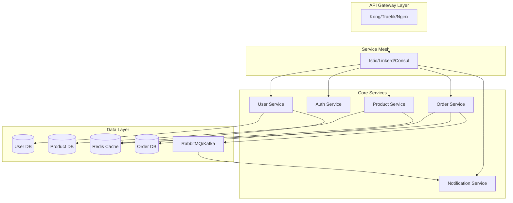
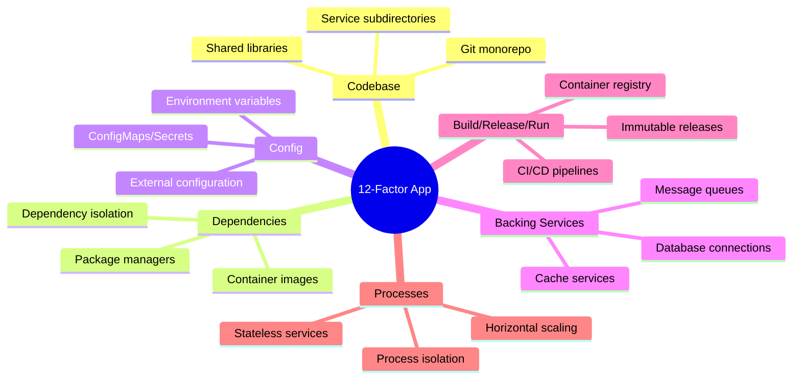
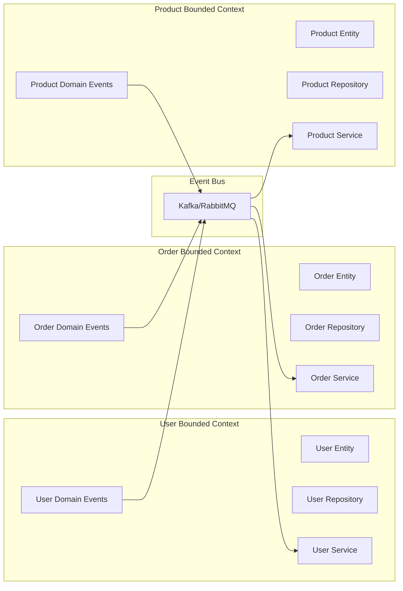
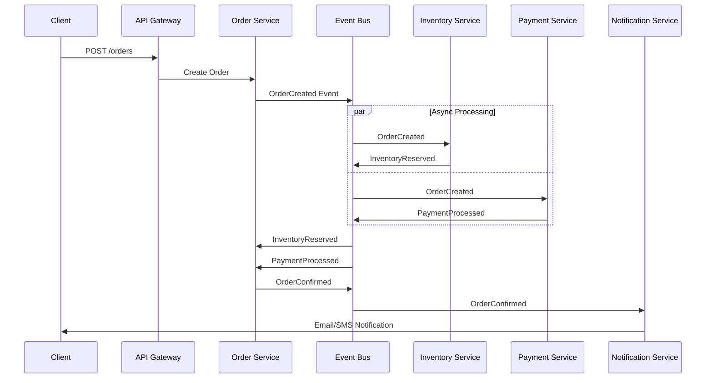
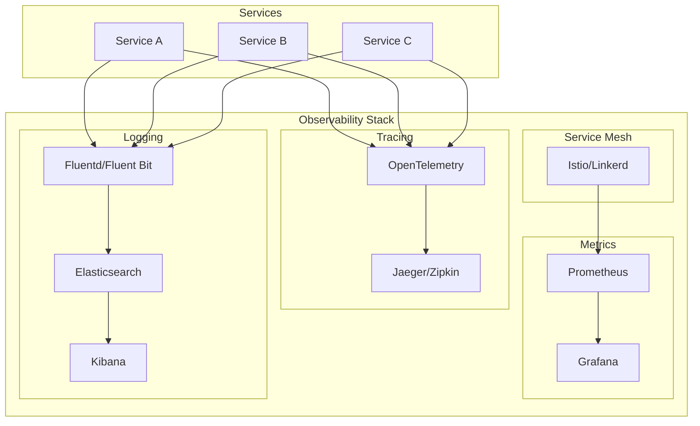
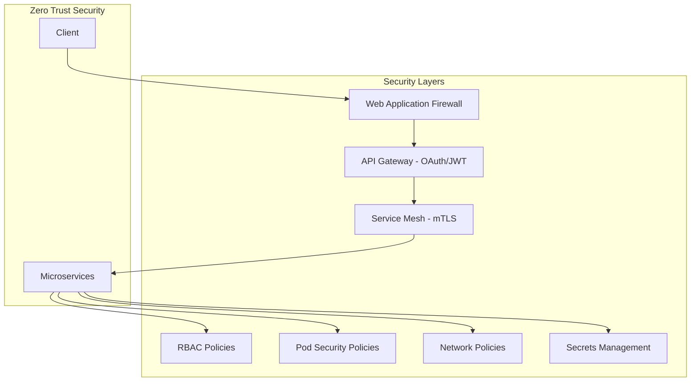
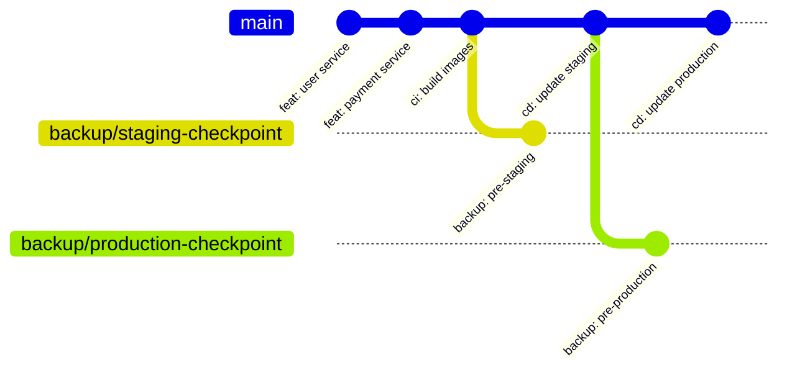

# Microservices Architecture Documentation Command

**ALWAYS THINK THEN...** Before executing any action, operation, or command in this instruction set, you MUST use thinking to:
1. Analyze the request and understand what needs to be done
2. Plan your approach and identify potential issues
3. Consider the implications and requirements
4. Only then proceed with the actual execution

**This thinking requirement is MANDATORY and must be followed for every action.**


## CANONICAL PROTOCOL ENFORCEMENT - READ FIRST

**THIS SECTION IS MANDATORY AND MUST BE READ, INDEXED, AND FOLLOWED BEFORE ANY COMMAND EXECUTION**

### 1. PROTOCOL COMPLIANCE REQUIREMENTS

**BEFORE PROCEEDING, YOU MUST:**
1. READ AND INDEX: `./claude/commands/protocol/code-protocol-compliance-prompt.md`
2. **READ AND INDEX: `./claude/commands/protocol/documentation-protocol-mandatory.md`** - MANDATORY documentation protocol
3. **READ AND INDEX: `./claude/commands/protocol/enduring-documentation-enforcement.md`** - MANDATORY enforcement protocol
4. VERIFY: User has given explicit permission to proceed
5. ACKNOWLEDGE: ALL CANONICAL PROTOCOL requirements including documentation protocols

**FORBIDDEN:** Proceeding without complete protocol compliance verification

### 2. MANDATORY DOCUMENTATION PROTOCOL ENFORCEMENT - RFC 2119 COMPLIANCE

**CANONICAL REQUIREMENT - DOCUMENTATION PROTOCOL READING:**
- **MUST READ AND ACKNOWLEDGE:** Production code deployment focused documentation protocol
- **MUST READ AND ACKNOWLEDGE:** Enduring documentation enforcement and destruction protocol
- **MANDATORY COMPLIANCE:** All microservices architecture documentation MUST comply with enduring documentation directive
- **DESTRUCTION PROTOCOL:** Non-compliant documentation WILL BE DESTROYED per canonical directive

**FOR ALL MICROSERVICES ARCHITECTURE DOCUMENTATION, YOU MUST:**
- **MUST:** Create enduring architecture documentation that explains HOW TO USE microservices patterns
- **MUST NOT:** Create temporal documents recording architectural decisions made
- **MUST:** Follow date-stamped version-controlled filename convention
- **MUST:** Create documentation ONLY when explicitly instructed by user
- **FORBIDDEN:** Proactive architecture documentation creation without explicit user instruction
- **MUST:** Create documentation ONLY in Jupyter notebooks with proper cell structure
- **MUST:** Focus on enduring microservices usage guidance and implementation patterns

### 3. GIT BEST PRACTICES - MANDATORY

**YOU MUST ALWAYS:**
- Create properly named branches from development branch
- FORBIDDEN: Work directly on main/master/development branches
- Make atomic commits with descriptive messages
- Commit after EVERY logical change
- Push to remote frequently for backup
- Use conventional commit format: `type(scope): description`

**BRANCH NAMING CONVENTIONS:**
- `feature/<name>` - New features or enhancements
- `fix/<name>` or `bugfix/<name>` - Bug fixes
- `hotfix/<name>` - Urgent production fixes
- `refactor/<name>` - Code refactoring without functionality change
- `docs/<name>` - Documentation updates only
- `test/<name>` - Test additions or modifications
- `chore/<name>` - Maintenance tasks, dependency updates
- `perf/<name>` - Performance improvements
- `style/<name>` - Code style/formatting changes
- `ci/<name>` - CI/CD pipeline changes
- `build/<name>` - Build system changes
- `revert/<name>` - Reverting previous changes

**BRANCH EXAMPLES:**
- `feature/user-authentication`
- `fix/login-timeout-issue`
- `hotfix/critical-security-patch`
- `refactor/database-connection-pooling`
- `docs/api-documentation-update`
- `chore/update-dependencies`

**COMMIT TYPES:**
- `feat:` New feature
- `fix:` Bug fix
- `refactor:` Code refactoring
- `docs:` Documentation only
- `test:` Test additions/changes
- `chore:` Maintenance tasks
- `perf:` Performance improvements
- `style:` Code style changes
- `ci:` CI/CD changes
- `build:` Build system changes
- `revert:` Revert previous commit

### 3. CONTAINERIZED APPLICATION REQUIREMENTS

**FOR CONTAINERIZED APPLICATIONS, YOU MUST:**
1. Build the container after EVERY code change
2. Check container logs for errors/warnings
3. Validate application functionality
4. Ensure all services are healthy
5. Test API endpoints if applicable
6. Verify no regression issues

**IF BUILD/DEPLOY ISSUES OCCUR:**
- Follow debugging protocol in `./claude/commands/code/code-debug.md`
- Use refactoring protocol in `./claude/commands/code/code-refactor.md`
- Apply planning protocol in `./claude/commands/code/code-planning.md`
- Implement fixes per `./claude/commands/code/code-implement.md`
- Ensure security compliance per `./claude/commands/code/code-security-analysis.md`

### 4. CODE CHANGE COMPLIANCE

**FOR ALL CODE CHANGES, YOU MUST:**
1. Find the relevant command in `./claude/commands/code/` for your current task
2. READ the entire command protocol
3. UNDERSTAND the requirements and patterns
4. FOLLOW the protocol exactly for consistency and correctness

**COMMAND MAPPING:**
- Debugging issues → `code-debug.md`
- Implementation → `code-implement.md`
- Refactoring → `code-refactor.md`
- Performance → `code-performance-analysis.md`
- Security → `code-security-analysis.md`
- Testing → `code-testing-live-api.md`
- Documentation → `code-documentation.md`

### 5. RTFM (READ THE FUCKING MANUAL) - MANDATORY

**YOU MUST ALWAYS:**

1. **READ JUPYTER NOTEBOOKS:**
   - Search for .ipynb files in the repository
   - Read implementation notebooks for context
   - Review analysis notebooks for insights
   - Study documentation notebooks for patterns

2. **READ PROJECT DOCUMENTATION:**
   - Check `./docs` directory thoroughly
   - Check `./project/docs` if it exists
   - Read ALL README files
   - Review architecture documentation
   - Study API documentation

3. **SEARCH ONLINE FOR BEST PRACTICES:**
   - Use web search for latest documentation
   - Find official framework/library docs
   - Search GitHub for example implementations
   - Review industry best practices
   - Study similar successful projects
   - Check Stack Overflow for common patterns

**SEARCH PRIORITIES:**
- Official documentation (latest version)
- GitHub repositories with high stars
- Industry standard implementations
- Recent blog posts/tutorials (< 1 year old)
- Community best practices

### 6. MANDATORY DEVSECOPS LOOP

**ALL CODE OPERATIONS MUST FOLLOW THE DEVSECOPS CYCLE:**

**THE INFINITE LOOP (for each change):**
```
┌─────────────────────────────────────────────────────────┐
│                                                         │
│  1. PLAN → 2. CODE → 3. BUILD → 4. TEST → 5. DEPLOY   │
│       ↑                                          ↓      │
│       │                                          ↓      │
│  8. MONITOR ← 7. OPERATE ← 6. SECURE/VALIDATE ←─┘      │
│       │                                                 │
│       └─────────────────────────────────────────────────┘
```

**MANDATORY PHASES FOR EVERY CODE CHANGE:**

1. **PLAN** (code-planning.md)
   - Requirements analysis
   - Code reuse discovery
   - Architecture design
   - Implementation blueprint
   - Validation workflow
   - Git strategy planning

2. **CODE** (code-implement.md)
   - Follow implementation blueprint
   - Apply SOLID/DRY/KISS
   - Implement debug logging
   - Write production code only
   - In-place modifications only

3. **BUILD** (code-validation.md)
   - Compile all code
   - Run linters
   - Type checking
   - Complexity analysis
   - Dependency validation

4. **TEST** (code-testing-live-api.md)
   - Unit tests
   - Integration tests
   - API tests
   - Performance tests
   - Security tests

5. **DEPLOY** (code-deploy.md)
   - Container build
   - Environment validation
   - Service health checks
   - Rollback preparation
   - Deployment execution

6. **SECURE/VALIDATE** (code-security-analysis.md)
   - Security scanning
   - Vulnerability assessment
   - Compliance checking
   - Access control validation
   - Encryption verification

7. **OPERATE** (code-operational-analysis.md)
   - Log analysis
   - Performance monitoring
   - Error tracking
   - Resource utilization
   - Service availability

8. **MONITOR** (code-review.md)
   - Code quality metrics
   - Technical debt assessment
   - Improvement identification
   - Feedback incorporation
   - Loop restart planning

**ENFORCEMENT RULES:**
- NO skipping phases
- NO proceeding on failures
- MUST complete each phase
- MUST document outcomes
- MUST validate before next phase

**200% VERIFICATION METHODOLOGY:**

**FIRST 100% - PRIMARY VERIFICATION:**
1. Execute all tests in the phase
2. Validate all outputs
3. Check all logs
4. Confirm functionality
5. Document results

**SECOND 100% - INDEPENDENT DOUBLE-CHECK:**
1. Different verification approach
2. Cross-validate results
3. Manual spot checks
4. Edge case testing
5. Third-party validation

**VERIFICATION RULES:**
- TWO independent verification activities
- DIFFERENT methodologies for each
- NO shared assumptions
- SEPARATE validation paths
- BOTH must pass 100%


### 7. ENTERPRISE CODE CHANGE SAFETY

**MANDATORY SAFETY PROTOCOL:**
1. **ANALYZE** before changing (understand dependencies)
2. **PLAN** the change (document approach)
3. **IMPLEMENT** incrementally (small atomic changes)
4. **TEST** after each change (unit + integration)
5. **VALIDATE** in container/deployment
6. **DOCUMENT** what was changed and why
7. **COMMIT** with clear message

**FORBIDDEN PRACTICES:**
- Making large, non-atomic changes
- Skipping tests or validation
- Ignoring build/deploy errors
- Proceeding without understanding
- Creating duplicate functionality
- Using outdated patterns


**ABSOLUTELY FORBIDDEN - NO EXCEPTIONS:**
- **NO MOCKING** of data or services in production code
- **NO TODOs** - complete ALL work immediately
- **NO SHORTCUTS** - implement properly ALWAYS
- **NO STUBS** - write complete implementations
- **NO FIXED DATA** - use real, dynamic data
- **NO HARDCODED VALUES** - use configuration
- **NO WORKAROUNDS** - fix root causes
- **NO FAKE IMPLEMENTATIONS** - real code only
- **NO PLACEHOLDER CODE** - production-ready only
- **NO TEMPORARY SOLUTIONS** - permanent fixes only

**YOU MUST ALWAYS:**
- IMPLEMENT production code to HIGHEST enterprise standards
- FIX issues properly at the root cause
- COMPLETE all functionality before moving on
- USE real data, real services, real implementations
- MAINTAIN professional quality in EVERY line of code
### 8. MANDATORY MCP SERVER TOOL USAGE

**ALL LLMs MUST UTILIZE MCP SERVER TOOLS:**

**REQUIRED MCP TOOLS FOR ALL OPERATIONS:**

1. **THINKING TOOLS** - MANDATORY for complex tasks
   - `thinking` - For deep analysis and problem solving
   - `sequential_thinking` - For step-by-step execution
   - Use BEFORE making decisions
   - Use DURING complex implementations
   - Use WHEN debugging issues

2. **CONTEXT & MEMORY TOOLS** - MANDATORY for continuity
   - `context7` - For maintaining conversation context
   - `memory` - For tracking actions, decisions, progress
   - `fetch` - For retrieving information
   - MUST record ALL decisions in memory
   - MUST track ALL progress in memory
   - MUST maintain context across sessions

3. **TASK ORCHESTRATION** - MANDATORY for organization
   - `task_orchestrator` - For managing tasks/subtasks
   - `project_maestro` - For project-level coordination
   - Create tasks for ALL work items
   - Track progress systematically
   - Update status continuously

4. **CODE & FILE TOOLS** - USE APPROPRIATE TOOL
   - `read_file` / `write_file` - For file operations
   - `search` / `grep` - For code searching
   - `git` - For version control
   - Choose the BEST tool for the task
   - Don't use generic when specific exists

**MCP TOOL DISCOVERY & INSTALLATION:**

**YOU MUST USE CLAUDE CODE CLI's OWN COMMANDS:**

1. **LIST AVAILABLE TOOLS** using Claude CLI:
   ```
   /mcp list              # List all available MCP servers
   /mcp status            # Check which tools are enabled
   ```

2. **ENABLE REQUIRED TOOLS** using Claude CLI:
   ```
   /mcp enable thinking
   /mcp enable sequential-thinking
   /mcp enable memory
   /mcp enable context7
   /mcp enable task-orchestrator
   /mcp enable fetch
   ```

3. **SEARCH & INSTALL** new tools if needed:
   ```
   /mcp search <tool-name>     # Search for available tools
   /mcp install <tool-repo>    # Install from repository
   /mcp configure <tool>       # Configure the tool
   /mcp enable <tool>          # Enable for use
   ```

4. **VERIFY TOOLS ARE ACTIVE**:
   ```
   /mcp status                 # Confirm tools are running
   /mcp test <tool>           # Test tool connectivity
   ```

**TOOL SELECTION CRITERIA:**
- Is there a SPECIFIC tool for this task?
- Would a specialized tool be BETTER?
- Can I COMBINE tools for efficiency?
- Should I INSTALL a new tool?

**MANDATORY TOOL USAGE PATTERNS:**

```
BEFORE ANY TASK:
1. Use 'thinking' to analyze approach
2. Use 'memory' to check previous work
3. Use 'task_orchestrator' to plan steps

DURING EXECUTION:
1. Use 'sequential_thinking' for complex logic
2. Use appropriate file/code tools
3. Update 'memory' with progress

AFTER COMPLETION:
1. Update 'task_orchestrator' status
2. Save summary to 'memory'
3. Use 'context7' to maintain state
```

**FORBIDDEN PRACTICES:**
- Working WITHOUT MCP tools
- Using GENERIC tools when specific exist
- IGNORING available MCP capabilities
- NOT searching for better tools
- NOT installing needed tools


### 9. COMPLIANCE VERIFICATION CHECKLIST

Before proceeding with ANY command:
- [ ] Protocol files read and indexed?
- [ ] User permission verified?
- [ ] Feature branch created?
- [ ] Relevant code command identified?
- [ ] Documentation reviewed?
- [ ] Online research completed?
- [ ] Dependencies understood?
- [ ] Test strategy planned?
- [ ] Rollback plan ready?

- [ ] MCP tools inventory completed?
- [ ] Appropriate MCP tools selected?
- [ ] Memory/context tools engaged?

**ENFORCEMENT:** Any violation requires IMMEDIATE STOP and correction

---

### 10. MANDATORY CODEBASE HYGIENE ENFORCEMENT

**GOOD CODEBASE HYGIENE IS STRICTLY ENFORCED - NO EXCEPTIONS**

**AFTER EVERY CODE CHANGE, YOU MUST:**

1. **RUN REPO CLEANUP COMMANDS** from `.claude/commands/repo/`:
   ```
   /repo-cleanup-code-files        # Remove test scripts, demos, duplicates
   /repo-cleanup-documentation     # Clean doc sprawl, convert to notebooks
   /repo-cleanup-unicode-emoji     # Remove ALL Unicode/emoji
   /repo-cleanup-config-scripts    # Convert forbidden scripts
   ```

2. **ENFORCE HYGIENE ON YOUR OWN WORK:**
   - Check for files YOU created with "fix", "clean", "final" in names
   - Verify NO temporary files remain
   - Ensure NO duplicate code exists
   - Confirm NO TODOs or stubs left
   - Validate NO hardcoded values

3. **CODEBASE HYGIENE CHECKLIST:**
   - [ ] NO test_*.py files in root
   - [ ] NO demo or example files
   - [ ] NO duplicate implementations
   - [ ] NO Unicode or emoji anywhere
   - [ ] NO shell/batch/PowerShell scripts
   - [ ] NO point-in-time reports
   - [ ] NO multiple README files per directory
   - [ ] NO backup or temporary files

**MANDATORY CLEANUP SEQUENCE:**
```bash
# After final atomic commit:
/repo-cleanup-code-files        # Clean code artifacts
/repo-cleanup-documentation     # Clean doc artifacts
/repo-cleanup-unicode-emoji     # Clean Unicode
/repo-cleanup-master           # Run master cleanup
```


### 11. POST-COMPLETION REINITIALIZATION

**AFTER CLEANUP AND HYGIENE CHECK, YOU MUST:**

```
/init                      # Reinitialize CLAUDE.md for next session
```

**THIS COMMAND:**
- Updates CLAUDE.md with latest context
- Clears temporary state
- Prepares for next command/instruction
- Ensures clean slate for next task

**MANDATORY EXECUTION:**
- AFTER repo cleanup commands
- AFTER final hygiene check
- BEFORE starting new task
- WHEN switching contexts
- AT session boundaries


**REMEMBER:** Professional enterprise development requires discipline, planning, and systematic execution. NO SHORTCUTS.

Generate microservices architecture documentation following cloud-native principles for: $argument

## Architecture Framework

This command follows established open source microservices patterns and frameworks:
- **12-Factor App** methodology
- **Cloud Native Computing Foundation (CNCF)** principles
- **Domain-Driven Design (DDD)** patterns
- **Event-Driven Architecture** patterns
- **Service Mesh** architecture
- **API-First** design principles

## Core Architecture Components

### 1. Service Decomposition & Boundaries



**Required Documentation:**
- Service boundaries following DDD bounded contexts
- Service contracts and API specifications (OpenAPI 3.0)
- Data ownership and consistency boundaries
- Service dependencies and coupling analysis
- Autonomous service criteria checklist

### 2. 12-Factor App Compliance

#### Factor Checklist and Implementation


**Required Documentation:**
- [ ] I. Codebase - One codebase tracked in revision control
- [ ] II. Dependencies - Explicitly declare and isolate dependencies
- [ ] III. Config - Store config in the environment
- [ ] IV. Backing services - Treat backing services as attached resources
- [ ] V. Build, release, run - Strictly separate build and run stages
- [ ] VI. Processes - Execute the app as one or more stateless processes
- [ ] VII. Port binding - Export services via port binding
- [ ] VIII. Concurrency - Scale out via the process model
- [ ] IX. Disposability - Maximize robustness with fast startup and graceful shutdown
- [ ] X. Dev/prod parity - Keep development, staging, and production as similar as possible
- [ ] XI. Logs - Treat logs as event streams
- [ ] XII. Admin processes - Run admin/management tasks as one-off processes

### 3. Cloud Native Architecture Patterns

```mermaid
C4Container
    title Cloud Native Microservices Architecture
    
    Person(user, "User", "Service consumer")
    
    System_Boundary(cdn, "CDN") {
        Container(cloudflare, "Cloudflare", "CDN", "Global edge caching")
    }
    
    System_Boundary(k8s, "Kubernetes Cluster") {
        Container(ingress, "Ingress Controller", "NGINX", "Load balancing & SSL termination")
        Container(gateway, "API Gateway", "Kong", "Rate limiting, auth, routing")
        Container(mesh, "Service Mesh", "Istio", "Service discovery, observability")
        
        System_Boundary(services, "Microservices") {
            Container(auth, "Auth Service", "Go", "JWT authentication")
            Container(user, "User Service", "Node.js", "User management")
            Container(product, "Product Service", "Java", "Product catalog")
            Container(order, "Order Service", "Python", "Order processing")
        }
        
        System_Boundary(data, "Data Stores") {
            ContainerDb(postgres, "PostgreSQL", "RDBMS", "Transactional data")
            ContainerDb(mongo, "MongoDB", "NoSQL", "Product catalog")
            ContainerDb(redis, "Redis", "Cache", "Session & cache")
            ContainerQueue(kafka, "Kafka", "Event Stream", "Event backbone")
        }
    }
    
    Rel(user, cloudflare, "HTTPS")
    Rel(cloudflare, ingress, "HTTPS")
    Rel(ingress, gateway, "HTTP")
    Rel(gateway, mesh, "gRPC/HTTP")
    Rel(mesh, services, "gRPC/HTTP")
    Rel(services, data, "TCP")
```

**Required Patterns:**
- Container orchestration with Kubernetes
- Service mesh for inter-service communication
- API gateway for external access
- Circuit breakers and retry patterns
- Distributed tracing and observability
- Health checks and self-healing

### 4. Domain-Driven Design Integration



**DDD Requirements:**
- Bounded context mapping
- Aggregate root identification
- Domain events and event sourcing
- CQRS implementation patterns
- Anti-corruption layers
- Context mapping strategies

### 5. API Design & Management

```yaml
# OpenAPI 3.0 Specification Template
openapi: 3.0.3
info:
  title: Microservice API
  version: 1.0.0
  description: |
    RESTful API following:
    - REST maturity level 3 (HATEOAS)
    - JSON:API or HAL specification
    - Versioning strategy (URL/Header)
    - Rate limiting headers
    - Correlation ID tracking
servers:
  - url: https://api.example.com/v1
paths:
  /resources:
    get:
      operationId: listResources
      parameters:
        - $ref: '#/components/parameters/pagination'
        - $ref: '#/components/parameters/filtering'
      responses:
        200:
          description: Success
          headers:
            X-Rate-Limit-Remaining:
              schema:
                type: integer
```

**API Requirements:**
- OpenAPI 3.0 specifications for all services
- API versioning strategy
- Rate limiting and throttling
- Request/response correlation
- Error handling standards
- HATEOAS implementation

### 7. Event-Driven Architecture



**Event Architecture Requirements:**
- Event schema registry
- Event sourcing patterns
- Saga pattern implementation
- Compensating transactions
- Event replay capabilities
- Dead letter queue handling

### 8. Observability & Monitoring



**Observability Requirements:**
- Distributed tracing (OpenTelemetry)
- Metrics collection (Prometheus)
- Centralized logging (ELK/EFK stack)
- Service mesh observability
- SLI/SLO/SLA definitions
- Alerting and incident response

### 9. Security Architecture



**Security Requirements:**
- Zero trust network architecture
- mTLS between services
- OAuth 2.0/OIDC implementation
- API key management
- Secrets rotation (HashiCorp Vault)
- Container image scanning
- Runtime security (Falco)

### 9. Deployment & GitOps



**Deployment Requirements:**
- GitOps workflow (ArgoCD/Flux)
- Progressive delivery (Flagger)
- Blue-green deployments
- Canary releases
- Feature flags (LaunchDarkly)
- Rollback procedures
- Disaster recovery

### 10. Service Mesh Configuration

```yaml
# Istio VirtualService Example
apiVersion: networking.istio.io/v1beta1
kind: VirtualService
metadata:
  name: user-service
spec:
  hosts:
  - user-service
  http:
  - match:
    - headers:
        version:
          exact: v2
    route:
    - destination:
        host: user-service
        subset: v2
      weight: 20  # Canary 20%
    - destination:
        host: user-service
        subset: v1
      weight: 80  # Stable 80%
  - route:
    - destination:
        host: user-service
        subset: v1
```

### Documentation Deliverables

1. **Architecture Decision Records (ADRs)**
   - Technology choices with rationale
   - Trade-off analysis
   - Migration strategies

2. **Service Catalog**
   - Service inventory with owners
   - API documentation links
   - Dependency mapping
   - SLA definitions

3. **Operations Runbook**
   - Deployment procedures
   - Incident response playbooks
   - Scaling guidelines
   - Monitoring dashboards

4. **Development Guidelines**
   - Local development setup
   - Testing strategies
   - Code review checklist
   - Performance benchmarks

### Quality Checklist

#### Architecture Compliance
- [ ] All services follow 12-Factor App principles
- [ ] DDD bounded contexts properly defined
- [ ] Event-driven patterns implemented
- [ ] Service mesh configured for all services
- [ ] Zero trust security implemented
- [ ] Observability stack fully integrated

#### Documentation Completeness
- [ ] All services have OpenAPI specifications
- [ ] Architecture diagrams use standard notation
- [ ] Runbooks cover common scenarios
- [ ] ADRs document key decisions
- [ ] Performance benchmarks documented
- [ ] Security controls documented

#### Operational Readiness
- [ ] CI/CD pipelines configured
- [ ] Monitoring dashboards created
- [ ] Alerts and SLOs defined
- [ ] Backup and recovery tested
- [ ] Load testing completed
- [ ] Security scanning integrated

Generate microservices architecture documentation following these cloud-native principles and patterns.