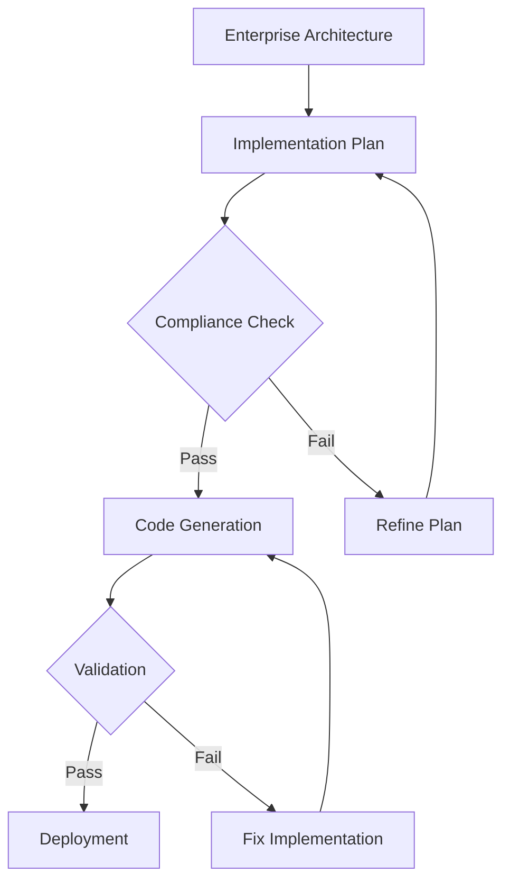

# Implementation Plan Command

**ALWAYS THINK THEN...** Before executing any action, operation, or command in this instruction set, you MUST use thinking to:
1. Analyze the request and understand what needs to be done
2. Plan your approach and identify potential issues
3. Consider the implications and requirements
4. Only then proceed with the actual execution

**This thinking requirement is MANDATORY and must be followed for every action.**


## CANONICAL PROTOCOL ENFORCEMENT - READ FIRST

**THIS SECTION IS MANDATORY AND MUST BE READ, INDEXED, AND FOLLOWED BEFORE ANY COMMAND EXECUTION**

### 1. PROTOCOL COMPLIANCE REQUIREMENTS

**BEFORE PROCEEDING, YOU MUST:**
1. READ AND INDEX: `./claude/commands/protocol/code-protocol-compliance-prompt.md`
3. VERIFY: User has given explicit permission to proceed
4. ACKNOWLEDGE: ALL CANONICAL PROTOCOL requirements

**FORBIDDEN:** Proceeding without complete protocol compliance verification

### 2. GIT BEST PRACTICES - MANDATORY

**YOU MUST ALWAYS:**
- Create properly named branches from development branch
- FORBIDDEN: Work directly on main/master/development branches
- Make atomic commits with descriptive messages
- Commit after EVERY logical change
- Push to remote frequently for backup
- Use conventional commit format: `type(scope): description`

**BRANCH NAMING CONVENTIONS:**
- `feature/<name>` - New features or enhancements
- `fix/<name>` or `bugfix/<name>` - Bug fixes
- `hotfix/<name>` - Urgent production fixes
- `refactor/<name>` - Code refactoring without functionality change
- `docs/<name>` - Documentation updates only
- `test/<name>` - Test additions or modifications
- `chore/<name>` - Maintenance tasks, dependency updates
- `perf/<name>` - Performance improvements
- `style/<name>` - Code style/formatting changes
- `ci/<name>` - CI/CD pipeline changes
- `build/<name>` - Build system changes
- `revert/<name>` - Reverting previous changes

**BRANCH EXAMPLES:**
- `feature/user-authentication`
- `fix/login-timeout-issue`
- `hotfix/critical-security-patch`
- `refactor/database-connection-pooling`
- `docs/api-documentation-update`
- `chore/update-dependencies`

**COMMIT TYPES:**
- `feat:` New feature
- `fix:` Bug fix
- `refactor:` Code refactoring
- `docs:` Documentation only
- `test:` Test additions/changes
- `chore:` Maintenance tasks
- `perf:` Performance improvements
- `style:` Code style changes
- `ci:` CI/CD changes
- `build:` Build system changes
- `revert:` Revert previous commit

### 3. CONTAINERIZED APPLICATION REQUIREMENTS

**FOR CONTAINERIZED APPLICATIONS, YOU MUST:**
1. Build the container after EVERY code change
2. Check container logs for errors/warnings
3. Validate application functionality
4. Ensure all services are healthy
5. Test API endpoints if applicable
6. Verify no regression issues

**IF BUILD/DEPLOY ISSUES OCCUR:**
- Follow debugging protocol in `./claude/commands/code/code-debug.md`
- Use refactoring protocol in `./claude/commands/code/code-refactor.md`
- Apply planning protocol in `./claude/commands/code/code-planning.md`
- Implement fixes per `./claude/commands/code/code-implement.md`
- Ensure security compliance per `./claude/commands/code/code-security-analysis.md`

### 4. CODE CHANGE COMPLIANCE

**FOR ALL CODE CHANGES, YOU MUST:**
1. Find the relevant command in `./claude/commands/code/` for your current task
2. READ the entire command protocol
3. UNDERSTAND the requirements and patterns
4. FOLLOW the protocol exactly for consistency and correctness

**COMMAND MAPPING:**
- Debugging issues → `code-debug.md`
- Implementation → `code-implement.md`
- Refactoring → `code-refactor.md`
- Performance → `code-performance-analysis.md`
- Security → `code-security-analysis.md`
- Testing → `code-testing-live-api.md`
- Documentation → `code-documentation.md`

### 5. RTFM (READ THE FUCKING MANUAL) - MANDATORY

**YOU MUST ALWAYS:**

1. **READ JUPYTER NOTEBOOKS:**
   - Search for .ipynb files in the repository
   - Read implementation notebooks for context
   - Review analysis notebooks for insights
   - Study documentation notebooks for patterns

2. **READ PROJECT DOCUMENTATION:**
   - Check `./docs` directory thoroughly
   - Check `./project/docs` if it exists
   - Read ALL README files
   - Review architecture documentation
   - Study API documentation

3. **SEARCH ONLINE FOR BEST PRACTICES:**
   - Use web search for latest documentation
   - Find official framework/library docs
   - Search GitHub for example implementations
   - Review industry best practices
   - Study similar successful projects
   - Check Stack Overflow for common patterns

**SEARCH PRIORITIES:**
- Official documentation (latest version)
- GitHub repositories with high stars
- Industry standard implementations
- Recent blog posts/tutorials (< 1 year old)
- Community best practices

### 6. MANDATORY DEVSECOPS LOOP

**ALL CODE OPERATIONS MUST FOLLOW THE DEVSECOPS CYCLE:**

**THE INFINITE LOOP (for each change):**
```
┌─────────────────────────────────────────────────────────┐
│                                                         │
│  1. PLAN → 2. CODE → 3. BUILD → 4. TEST → 5. DEPLOY   │
│       ↑                                          ↓      │
│       │                                          ↓      │
│  8. MONITOR ← 7. OPERATE ← 6. SECURE/VALIDATE ←─┘      │
│       │                                                 │
│       └─────────────────────────────────────────────────┘
```

**MANDATORY PHASES FOR EVERY CODE CHANGE:**

1. **PLAN** (code-planning.md)
   - Requirements analysis
   - Code reuse discovery
   - Architecture design
   - Implementation blueprint
   - Validation workflow
   - Git strategy planning

2. **CODE** (code-implement.md)
   - Follow implementation blueprint
   - Apply SOLID/DRY/KISS
   - Implement debug logging
   - Write production code only
   - In-place modifications only

3. **BUILD** (code-validation.md)
   - Compile all code
   - Run linters
   - Type checking
   - Complexity analysis
   - Dependency validation

4. **TEST** (code-testing-live-api.md)
   - Unit tests
   - Integration tests
   - API tests
   - Performance tests
   - Security tests

5. **DEPLOY** (code-deploy.md)
   - Container build
   - Environment validation
   - Service health checks
   - Rollback preparation
   - Deployment execution

6. **SECURE/VALIDATE** (code-security-analysis.md)
   - Security scanning
   - Vulnerability assessment
   - Compliance checking
   - Access control validation
   - Encryption verification

7. **OPERATE** (code-operational-analysis.md)
   - Log analysis
   - Performance monitoring
   - Error tracking
   - Resource utilization
   - Service availability

8. **MONITOR** (code-review.md)
   - Code quality metrics
   - Technical debt assessment
   - Improvement identification
   - Feedback incorporation
   - Loop restart planning

**ENFORCEMENT RULES:**
- NO skipping phases
- NO proceeding on failures
- MUST complete each phase
- MUST document outcomes
- MUST validate before next phase

**200% VERIFICATION METHODOLOGY:**

**FIRST 100% - PRIMARY VERIFICATION:**
1. Execute all tests in the phase
2. Validate all outputs
3. Check all logs
4. Confirm functionality
5. Document results

**SECOND 100% - INDEPENDENT DOUBLE-CHECK:**
1. Different verification approach
2. Cross-validate results
3. Manual spot checks
4. Edge case testing
5. Third-party validation

**VERIFICATION RULES:**
- TWO independent verification activities
- DIFFERENT methodologies for each
- NO shared assumptions
- SEPARATE validation paths
- BOTH must pass 100%


### 7. ENTERPRISE CODE CHANGE SAFETY

**MANDATORY SAFETY PROTOCOL:**
1. **ANALYZE** before changing (understand dependencies)
2. **PLAN** the change (document approach)
3. **IMPLEMENT** incrementally (small atomic changes)
4. **TEST** after each change (unit + integration)
5. **VALIDATE** in container/deployment
6. **DOCUMENT** what was changed and why
7. **COMMIT** with clear message

**FORBIDDEN PRACTICES:**
- Making large, non-atomic changes
- Skipping tests or validation
- Ignoring build/deploy errors
- Proceeding without understanding
- Creating duplicate functionality
- Using outdated patterns


**ABSOLUTELY FORBIDDEN - NO EXCEPTIONS:**
- **NO MOCKING** of data or services in production code
- **NO TODOs** - complete ALL work immediately
- **NO SHORTCUTS** - implement properly ALWAYS
- **NO STUBS** - write complete implementations
- **NO FIXED DATA** - use real, dynamic data
- **NO HARDCODED VALUES** - use configuration
- **NO WORKAROUNDS** - fix root causes
- **NO FAKE IMPLEMENTATIONS** - real code only
- **NO PLACEHOLDER CODE** - production-ready only
- **NO TEMPORARY SOLUTIONS** - permanent fixes only

**YOU MUST ALWAYS:**
- IMPLEMENT production code to HIGHEST enterprise standards
- FIX issues properly at the root cause
- COMPLETE all functionality before moving on
- USE real data, real services, real implementations
- MAINTAIN professional quality in EVERY line of code
### 8. MANDATORY MCP SERVER TOOL USAGE

**ALL LLMs MUST UTILIZE MCP SERVER TOOLS:**

**REQUIRED MCP TOOLS FOR ALL OPERATIONS:**

1. **THINKING TOOLS** - MANDATORY for complex tasks
   - `thinking` - For deep analysis and problem solving
   - `sequential_thinking` - For step-by-step execution
   - Use BEFORE making decisions
   - Use DURING complex implementations
   - Use WHEN debugging issues

2. **CONTEXT & MEMORY TOOLS** - MANDATORY for continuity
   - `context7` - For maintaining conversation context
   - `memory` - For tracking actions, decisions, progress
   - `fetch` - For retrieving information
   - MUST record ALL decisions in memory
   - MUST track ALL progress in memory
   - MUST maintain context across sessions

3. **TASK ORCHESTRATION** - MANDATORY for organization
   - `task_orchestrator` - For managing tasks/subtasks
   - `project_maestro` - For project-level coordination
   - Create tasks for ALL work items
   - Track progress systematically
   - Update status continuously

4. **CODE & FILE TOOLS** - USE APPROPRIATE TOOL
   - `read_file` / `write_file` - For file operations
   - `search` / `grep` - For code searching
   - `git` - For version control
   - Choose the BEST tool for the task
   - Don't use generic when specific exists

**MCP TOOL DISCOVERY & INSTALLATION:**

**YOU MUST USE CLAUDE CODE CLI's OWN COMMANDS:**

1. **LIST AVAILABLE TOOLS** using Claude CLI:
   ```
   /mcp list              # List all available MCP servers
   /mcp status            # Check which tools are enabled
   ```

2. **ENABLE REQUIRED TOOLS** using Claude CLI:
   ```
   /mcp enable thinking
   /mcp enable sequential-thinking
   /mcp enable memory
   /mcp enable context7
   /mcp enable task-orchestrator
   /mcp enable fetch
   ```

3. **SEARCH & INSTALL** new tools if needed:
   ```
   /mcp search <tool-name>     # Search for available tools
   /mcp install <tool-repo>    # Install from repository
   /mcp configure <tool>       # Configure the tool
   /mcp enable <tool>          # Enable for use
   ```

4. **VERIFY TOOLS ARE ACTIVE**:
   ```
   /mcp status                 # Confirm tools are running
   /mcp test <tool>           # Test tool connectivity
   ```

**TOOL SELECTION CRITERIA:**
- Is there a SPECIFIC tool for this task?
- Would a specialized tool be BETTER?
- Can I COMBINE tools for efficiency?
- Should I INSTALL a new tool?

**MANDATORY TOOL USAGE PATTERNS:**

```
BEFORE ANY TASK:
1. Use 'thinking' to analyze approach
2. Use 'memory' to check previous work
3. Use 'task_orchestrator' to plan steps

DURING EXECUTION:
1. Use 'sequential_thinking' for complex logic
2. Use appropriate file/code tools
3. Update 'memory' with progress

AFTER COMPLETION:
1. Update 'task_orchestrator' status
2. Save summary to 'memory'
3. Use 'context7' to maintain state
```

**FORBIDDEN PRACTICES:**
- Working WITHOUT MCP tools
- Using GENERIC tools when specific exist
- IGNORING available MCP capabilities
- NOT searching for better tools
- NOT installing needed tools


### 9. COMPLIANCE VERIFICATION CHECKLIST

Before proceeding with ANY command:
- [ ] Protocol files read and indexed?
- [ ] User permission verified?
- [ ] Feature branch created?
- [ ] Relevant code command identified?
- [ ] Documentation reviewed?
- [ ] Online research completed?
- [ ] Dependencies understood?
- [ ] Test strategy planned?
- [ ] Rollback plan ready?

- [ ] MCP tools inventory completed?
- [ ] Appropriate MCP tools selected?
- [ ] Memory/context tools engaged?

**ENFORCEMENT:** Any violation requires IMMEDIATE STOP and correction

---

### 10. MANDATORY CODEBASE HYGIENE ENFORCEMENT

**GOOD CODEBASE HYGIENE IS STRICTLY ENFORCED - NO EXCEPTIONS**

**AFTER EVERY CODE CHANGE, YOU MUST:**

1. **RUN REPO CLEANUP COMMANDS** from `.claude/commands/repo/`:
   ```
   /repo-cleanup-code-files        # Remove test scripts, demos, duplicates
   /repo-cleanup-documentation     # Clean doc sprawl, convert to notebooks
   /repo-cleanup-unicode-emoji     # Remove ALL Unicode/emoji
   /repo-cleanup-config-scripts    # Convert forbidden scripts
   ```

2. **ENFORCE HYGIENE ON YOUR OWN WORK:**
   - Check for files YOU created with "fix", "clean", "final" in names
   - Verify NO temporary files remain
   - Ensure NO duplicate code exists
   - Confirm NO TODOs or stubs left
   - Validate NO hardcoded values

3. **CODEBASE HYGIENE CHECKLIST:**
   - [ ] NO test_*.py files in root
   - [ ] NO demo or example files
   - [ ] NO duplicate implementations
   - [ ] NO Unicode or emoji anywhere
   - [ ] NO shell/batch/PowerShell scripts
   - [ ] NO point-in-time reports
   - [ ] NO multiple README files per directory
   - [ ] NO backup or temporary files

**MANDATORY CLEANUP SEQUENCE:**
```bash
# After final atomic commit:
/repo-cleanup-code-files        # Clean code artifacts
/repo-cleanup-documentation     # Clean doc artifacts
/repo-cleanup-unicode-emoji     # Clean Unicode
/repo-cleanup-master           # Run master cleanup
```


### 11. POST-COMPLETION REINITIALIZATION

**AFTER CLEANUP AND HYGIENE CHECK, YOU MUST:**

```
/init                      # Reinitialize CLAUDE.md for next session
```

**THIS COMMAND:**
- Updates CLAUDE.md with latest context
- Clears temporary state
- Prepares for next command/instruction
- Ensures clean slate for next task

**MANDATORY EXECUTION:**
- AFTER repo cleanup commands
- AFTER final hygiene check
- BEFORE starting new task
- WHEN switching contexts
- AT session boundaries


**REMEMBER:** Professional enterprise development requires discipline, planning, and systematic execution. NO SHORTCUTS.

Generate a detailed implementation plan from enterprise architecture documentation that enables any LLM to implement the application with strict architecture compliance for: $argument

## Purpose

This command bridges the gap between high-level enterprise architecture and actual code implementation by providing:
- Exact function signatures and implementations
- Class hierarchies with all methods defined
- Module structure and dependencies
- Data models and schemas
- Test specifications for each component
- LLM-specific implementation instructions

## Implementation Plan Structure

### 1. Architecture Compliance Verification



**Pre-Implementation Checklist:**
```yaml
architecture_compliance:
  - service_boundaries: "Verify all services match bounded contexts"
  - api_contracts: "Ensure all APIs follow OpenAPI specifications"
  - data_models: "Validate data ownership and consistency"
  - security_patterns: "Confirm zero-trust implementation"
  - event_schemas: "Verify event-driven patterns"
  - deployment_model: "Check GitOps compliance"
```

### 2. Service Implementation Specification

For each microservice identified in the architecture, provide:

#### Service Metadata
```yaml
service:
  name: "user-service"
  description: "User management and authentication service"
  bounded_context: "User Management"
  technology_stack:
    language: "TypeScript"
    framework: "NestJS"
    runtime: "Node.js 20.x"
    database: "PostgreSQL 15"
    cache: "Redis 7"
  dependencies:
    internal:
      - "auth-service"
      - "notification-service"
    external:
      - "SendGrid API"
      - "Auth0"
  ports:
    http: 3001
    grpc: 50051
    metrics: 9091
```

#### Module Structure
```typescript
// src/modules/user/user.module.ts
@Module({
  imports: [
    TypeOrmModule.forFeature([User, UserProfile, UserPreference]),
    CacheModule.register({
      store: redisStore,
      host: process.env.REDIS_HOST,
      port: process.env.REDIS_PORT,
    }),
    AuthModule,
    NotificationModule,
  ],
  controllers: [UserController, UserProfileController],
  providers: [
    UserService,
    UserRepository,
    UserEventPublisher,
    UserSaga,
    UserValidator,
    UserMapper,
  ],
  exports: [UserService, UserRepository],
})
export class UserModule {}
```

#### Complete Class Implementations

```typescript
// src/modules/user/domain/entities/user.entity.ts
@Entity('users')
export class User extends AggregateRoot {
  @PrimaryGeneratedColumn('uuid')
  id: string;

  @Column({ unique: true })
  @Index()
  email: string;

  @Column()
  passwordHash: string;

  @Column({ type: 'jsonb' })
  profile: UserProfile;

  @Column({ type: 'timestamp' })
  createdAt: Date;

  @Column({ type: 'timestamp' })
  updatedAt: Date;

  @Column({ default: true })
  isActive: boolean;

  @Column({ type: 'jsonb', nullable: true })
  preferences: UserPreference;

  // Domain methods
  changeEmail(newEmail: string): void {
    const oldEmail = this.email;
    this.email = newEmail;
    this.apply(new UserEmailChangedEvent(this.id, oldEmail, newEmail));
  }

  deactivate(): void {
    this.isActive = false;
    this.apply(new UserDeactivatedEvent(this.id));
  }

  updateProfile(profile: Partial<UserProfile>): void {
    this.profile = { ...this.profile, ...profile };
    this.apply(new UserProfileUpdatedEvent(this.id, this.profile));
  }

  // Validation methods
  validatePassword(password: string): boolean {
    return bcrypt.compareSync(password, this.passwordHash);
  }

  // Factory method
  static create(email: string, password: string, profile: UserProfile): User {
    const user = new User();
    user.id = uuid();
    user.email = email;
    user.passwordHash = bcrypt.hashSync(password, 10);
    user.profile = profile;
    user.createdAt = new Date();
    user.updatedAt = new Date();
    user.isActive = true;
    
    user.apply(new UserCreatedEvent(user.id, email));
    return user;
  }
}
```

#### Service Layer Implementation

```typescript
// src/modules/user/application/services/user.service.ts
@Injectable()
export class UserService {
  constructor(
    @InjectRepository(User)
    private readonly userRepository: Repository<User>,
    private readonly eventBus: EventBus,
    private readonly cacheManager: Cache,
    private readonly logger: Logger,
  ) {}

  // Command handlers
  async createUser(command: CreateUserCommand): Promise<UserDto> {
    this.logger.log(`Creating user with email: ${command.email}`);
    
    // Validation
    await this.validateEmailUniqueness(command.email);
    
    // Create aggregate
    const user = User.create(
      command.email,
      command.password,
      command.profile,
    );
    
    // Persist
    const savedUser = await this.userRepository.save(user);
    
    // Publish events
    user.getUncommittedEvents().forEach(event => 
      this.eventBus.publish(event)
    );
    
    // Cache
    await this.cacheManager.set(
      `user:${savedUser.id}`,
      savedUser,
      { ttl: 3600 }
    );
    
    return UserMapper.toDto(savedUser);
  }

  async updateUserProfile(
    userId: string, 
    command: UpdateProfileCommand
  ): Promise<UserDto> {
    const user = await this.findUserById(userId);
    
    user.updateProfile(command.profile);
    
    const updatedUser = await this.userRepository.save(user);
    
    // Invalidate cache
    await this.cacheManager.del(`user:${userId}`);
    
    // Publish events
    user.getUncommittedEvents().forEach(event => 
      this.eventBus.publish(event)
    );
    
    return UserMapper.toDto(updatedUser);
  }

  // Query handlers
  async findUserById(id: string): Promise<User> {
    // Try cache first
    const cached = await this.cacheManager.get<User>(`user:${id}`);
    if (cached) return cached;
    
    const user = await this.userRepository.findOne({ where: { id } });
    if (!user) {
      throw new NotFoundException(`User with ID ${id} not found`);
    }
    
    // Cache for next time
    await this.cacheManager.set(`user:${id}`, user, { ttl: 3600 });
    
    return user;
  }

  async findUserByEmail(email: string): Promise<User | null> {
    return this.userRepository.findOne({ where: { email } });
  }

  // Private methods
  private async validateEmailUniqueness(email: string): Promise<void> {
    const existing = await this.findUserByEmail(email);
    if (existing) {
      throw new ConflictException(`Email ${email} already in use`);
    }
  }
}
```

#### Controller Implementation

```typescript
// src/modules/user/interfaces/controllers/user.controller.ts
@Controller('users')
@ApiTags('users')
@UseInterceptors(LoggingInterceptor, TransformInterceptor)
export class UserController {
  constructor(
    private readonly userService: UserService,
    private readonly commandBus: CommandBus,
    private readonly queryBus: QueryBus,
  ) {}

  @Post()
  @ApiOperation({ summary: 'Create a new user' })
  @ApiResponse({ status: 201, type: UserResponseDto })
  @ApiResponse({ status: 409, description: 'Email already exists' })
  @UsePipes(new ValidationPipe({ transform: true }))
  async createUser(
    @Body() dto: CreateUserDto,
  ): Promise<UserResponseDto> {
    const command = new CreateUserCommand(
      dto.email,
      dto.password,
      dto.profile,
    );
    
    const user = await this.commandBus.execute(command);
    
    return {
      data: user,
      meta: {
        timestamp: new Date().toISOString(),
        version: '1.0',
      },
    };
  }

  @Get(':id')
  @ApiOperation({ summary: 'Get user by ID' })
  @ApiResponse({ status: 200, type: UserResponseDto })
  @ApiResponse({ status: 404, description: 'User not found' })
  @UseGuards(JwtAuthGuard)
  @CacheKey('user-by-id')
  @CacheTTL(300)
  async getUserById(
    @Param('id', ParseUUIDPipe) id: string,
  ): Promise<UserResponseDto> {
    const query = new GetUserByIdQuery(id);
    const user = await this.queryBus.execute(query);
    
    return {
      data: user,
      meta: {
        timestamp: new Date().toISOString(),
        version: '1.0',
      },
    };
  }

  @Put(':id/profile')
  @ApiOperation({ summary: 'Update user profile' })
  @ApiResponse({ status: 200, type: UserResponseDto })
  @UseGuards(JwtAuthGuard, UserOwnershipGuard)
  async updateProfile(
    @Param('id', ParseUUIDPipe) id: string,
    @Body() dto: UpdateProfileDto,
  ): Promise<UserResponseDto> {
    const command = new UpdateProfileCommand(id, dto);
    const user = await this.commandBus.execute(command);
    
    return {
      data: user,
      meta: {
        timestamp: new Date().toISOString(),
        version: '1.0',
      },
    };
  }
}
```

### 3. Data Models and Schemas

#### Database Schema
```sql
-- PostgreSQL schema for user service
CREATE EXTENSION IF NOT EXISTS "uuid-ossp";

CREATE TABLE users (
    id UUID PRIMARY KEY DEFAULT uuid_generate_v4(),
    email VARCHAR(255) UNIQUE NOT NULL,
    password_hash VARCHAR(255) NOT NULL,
    profile JSONB NOT NULL,
    preferences JSONB,
    is_active BOOLEAN DEFAULT true,
    created_at TIMESTAMP NOT NULL DEFAULT CURRENT_TIMESTAMP,
    updated_at TIMESTAMP NOT NULL DEFAULT CURRENT_TIMESTAMP,
    version INTEGER DEFAULT 1
);

CREATE INDEX idx_users_email ON users(email);
CREATE INDEX idx_users_active ON users(is_active) WHERE is_active = true;
CREATE INDEX idx_users_created_at ON users(created_at);

-- Audit table
CREATE TABLE user_events (
    id UUID PRIMARY KEY DEFAULT uuid_generate_v4(),
    aggregate_id UUID NOT NULL REFERENCES users(id),
    event_type VARCHAR(100) NOT NULL,
    event_data JSONB NOT NULL,
    event_version INTEGER NOT NULL,
    created_at TIMESTAMP NOT NULL DEFAULT CURRENT_TIMESTAMP
);

CREATE INDEX idx_user_events_aggregate ON user_events(aggregate_id);
CREATE INDEX idx_user_events_type ON user_events(event_type);
```

#### DTOs and Validation
```typescript
// src/modules/user/interfaces/dto/create-user.dto.ts
export class CreateUserDto {
  @ApiProperty({ example: 'user@example.com' })
  @IsEmail()
  @Transform(({ value }) => value.toLowerCase())
  email: string;

  @ApiProperty({ example: 'SecureP@ssw0rd!' })
  @IsString()
  @MinLength(8)
  @Matches(/^(?=.*[a-z])(?=.*[A-Z])(?=.*\d)(?=.*[@$!%*?&])[A-Za-z\d@$!%*?&]/)
  password: string;

  @ApiProperty({ type: UserProfileDto })
  @ValidateNested()
  @Type(() => UserProfileDto)
  profile: UserProfileDto;
}

export class UserProfileDto {
  @ApiProperty({ example: 'John' })
  @IsString()
  @MinLength(2)
  @MaxLength(50)
  firstName: string;

  @ApiProperty({ example: 'Doe' })
  @IsString()
  @MinLength(2)
  @MaxLength(50)
  lastName: string;

  @ApiProperty({ example: '+1234567890', required: false })
  @IsOptional()
  @IsPhoneNumber()
  phoneNumber?: string;

  @ApiProperty({ example: '1990-01-01', required: false })
  @IsOptional()
  @IsDateString()
  dateOfBirth?: string;
}
```

### 4. Event Definitions

```typescript
// src/modules/user/domain/events/user-created.event.ts
export class UserCreatedEvent implements IEvent {
  constructor(
    public readonly aggregateId: string,
    public readonly email: string,
    public readonly timestamp: Date = new Date(),
  ) {}

  getEventName(): string {
    return 'user.created';
  }

  getEventVersion(): number {
    return 1;
  }

  serialize(): Record<string, any> {
    return {
      aggregateId: this.aggregateId,
      email: this.email,
      timestamp: this.timestamp.toISOString(),
    };
  }
}

// Event handler
@EventsHandler(UserCreatedEvent)
export class UserCreatedHandler implements IEventHandler<UserCreatedEvent> {
  constructor(
    private readonly notificationService: NotificationService,
    private readonly analyticsService: AnalyticsService,
  ) {}

  async handle(event: UserCreatedEvent): Promise<void> {
    // Send welcome email
    await this.notificationService.sendWelcomeEmail(event.email);
    
    // Track analytics
    await this.analyticsService.track({
      event: 'user_created',
      userId: event.aggregateId,
      properties: {
        email: event.email,
      },
    });
  }
}
```

### 5. Test Specifications

#### Unit Tests
```typescript
// src/modules/user/tests/unit/user.service.spec.ts
describe('UserService', () => {
  let service: UserService;
  let repository: MockRepository<User>;
  let eventBus: MockEventBus;
  let cacheManager: MockCacheManager;

  beforeEach(() => {
    const module = Test.createTestingModule({
      providers: [
        UserService,
        {
          provide: getRepositoryToken(User),
          useClass: MockRepository,
        },
        {
          provide: EventBus,
          useClass: MockEventBus,
        },
        {
          provide: CACHE_MANAGER,
          useClass: MockCacheManager,
        },
      ],
    }).compile();

    service = module.get<UserService>(UserService);
    repository = module.get(getRepositoryToken(User));
    eventBus = module.get(EventBus);
    cacheManager = module.get(CACHE_MANAGER);
  });

  describe('createUser', () => {
    it('should create a user successfully', async () => {
      // Arrange
      const command = new CreateUserCommand(
        'test@example.com',
        'Password123!',
        {
          firstName: 'John',
          lastName: 'Doe',
        },
      );

      repository.findOne.mockResolvedValue(null);
      repository.save.mockImplementation(user => Promise.resolve(user));

      // Act
      const result = await service.createUser(command);

      // Assert
      expect(result).toBeDefined();
      expect(result.email).toBe('test@example.com');
      expect(repository.save).toHaveBeenCalledTimes(1);
      expect(eventBus.publish).toHaveBeenCalledWith(
        expect.any(UserCreatedEvent),
      );
      expect(cacheManager.set).toHaveBeenCalled();
    });

    it('should throw ConflictException for duplicate email', async () => {
      // Arrange
      const command = new CreateUserCommand(
        'existing@example.com',
        'Password123!',
        {
          firstName: 'John',
          lastName: 'Doe',
        },
      );

      repository.findOne.mockResolvedValue({ email: 'existing@example.com' });

      // Act & Assert
      await expect(service.createUser(command))
        .rejects.toThrow(ConflictException);
    });
  });
});
```

#### Integration Tests
```typescript
// src/modules/user/tests/integration/user.controller.spec.ts
describe('UserController (Integration)', () => {
  let app: INestApplication;
  let repository: Repository<User>;

  beforeAll(async () => {
    const module = await Test.createTestingModule({
      imports: [
        UserModule,
        TypeOrmModule.forRoot({
          type: 'postgres',
          host: 'localhost',
          port: 5432,
          username: 'test',
          password: 'test',
          database: 'test_db',
          entities: [User],
          synchronize: true,
        }),
      ],
    }).compile();

    app = module.createNestApplication();
    app.useGlobalPipes(new ValidationPipe());
    await app.init();

    repository = module.get<Repository<User>>(getRepositoryToken(User));
  });

  afterAll(async () => {
    await app.close();
  });

  describe('POST /users', () => {
    it('should create a new user', async () => {
      const createUserDto = {
        email: 'test@example.com',
        password: 'SecureP@ssw0rd!',
        profile: {
          firstName: 'John',
          lastName: 'Doe',
        },
      };

      const response = await request(app.getHttpServer())
        .post('/users')
        .send(createUserDto)
        .expect(201);

      expect(response.body.data).toMatchObject({
        email: 'test@example.com',
        profile: {
          firstName: 'John',
          lastName: 'Doe',
        },
      });

      const savedUser = await repository.findOne({
        where: { email: 'test@example.com' },
      });
      expect(savedUser).toBeDefined();
    });

    it('should validate request body', async () => {
      const invalidDto = {
        email: 'invalid-email',
        password: '123', // Too short
        profile: {
          firstName: 'J', // Too short
        },
      };

      const response = await request(app.getHttpServer())
        .post('/users')
        .send(invalidDto)
        .expect(400);

      expect(response.body.message).toContain('validation failed');
    });
  });
});
```

### 7. API Specifications

```yaml
# OpenAPI specification for user service
openapi: 3.0.3
info:
  title: User Service API
  version: 1.0.0
  description: User management and authentication service
servers:
  - url: http://localhost:3001/api/v1
    description: Development server
  - url: https://api.example.com/v1
    description: Production server

paths:
  /users:
    post:
      summary: Create a new user
      operationId: createUser
      tags:
        - Users
      requestBody:
        required: true
        content:
          application/json:
            schema:
              $ref: '#/components/schemas/CreateUserRequest'
      responses:
        '201':
          description: User created successfully
          content:
            application/json:
              schema:
                $ref: '#/components/schemas/UserResponse'
        '409':
          description: Email already exists
          content:
            application/json:
              schema:
                $ref: '#/components/schemas/ErrorResponse'

  /users/{userId}:
    get:
      summary: Get user by ID
      operationId: getUserById
      tags:
        - Users
      parameters:
        - name: userId
          in: path
          required: true
          schema:
            type: string
            format: uuid
      security:
        - bearerAuth: []
      responses:
        '200':
          description: User found
          content:
            application/json:
              schema:
                $ref: '#/components/schemas/UserResponse'
        '404':
          description: User not found
          content:
            application/json:
              schema:
                $ref: '#/components/schemas/ErrorResponse'

components:
  schemas:
    CreateUserRequest:
      type: object
      required:
        - email
        - password
        - profile
      properties:
        email:
          type: string
          format: email
          example: user@example.com
        password:
          type: string
          format: password
          minLength: 8
          pattern: '^(?=.*[a-z])(?=.*[A-Z])(?=.*\d)(?=.*[@$!%*?&])[A-Za-z\d@$!%*?&]'
          example: SecureP@ssw0rd!
        profile:
          $ref: '#/components/schemas/UserProfile'

    UserProfile:
      type: object
      required:
        - firstName
        - lastName
      properties:
        firstName:
          type: string
          minLength: 2
          maxLength: 50
          example: John
        lastName:
          type: string
          minLength: 2
          maxLength: 50
          example: Doe
        phoneNumber:
          type: string
          pattern: '^\+?[1-9]\d{1,14}$'
          example: '+1234567890'
        dateOfBirth:
          type: string
          format: date
          example: '1990-01-01'

    UserResponse:
      type: object
      properties:
        data:
          $ref: '#/components/schemas/User'
        meta:
          $ref: '#/components/schemas/ResponseMeta'

    User:
      type: object
      properties:
        id:
          type: string
          format: uuid
        email:
          type: string
          format: email
        profile:
          $ref: '#/components/schemas/UserProfile'
        isActive:
          type: boolean
        createdAt:
          type: string
          format: date-time
        updatedAt:
          type: string
          format: date-time

    ResponseMeta:
      type: object
      properties:
        timestamp:
          type: string
          format: date-time
        version:
          type: string

    ErrorResponse:
      type: object
      properties:
        error:
          type: object
          properties:
            code:
              type: string
            message:
              type: string
            details:
              type: array
              items:
                type: object
```

### 8. Infrastructure as Code

```typescript
// infrastructure/k8s/user-service.yaml
apiVersion: apps/v1
kind: Deployment
metadata:
  name: user-service
  labels:
    app: user-service
    version: v1
spec:
  replicas: 3
  selector:
    matchLabels:
      app: user-service
  template:
    metadata:
      labels:
        app: user-service
        version: v1
      annotations:
        prometheus.io/scrape: "true"
        prometheus.io/port: "9091"
        prometheus.io/path: "/metrics"
    spec:
      containers:
      - name: user-service
        image: user-service:1.0.0
        ports:
        - containerPort: 3001
          name: http
        - containerPort: 50051
          name: grpc
        - containerPort: 9091
          name: metrics
        env:
        - name: NODE_ENV
          value: "production"
        - name: DATABASE_URL
          valueFrom:
            secretKeyRef:
              name: user-service-secrets
              key: database-url
        - name: REDIS_URL
          valueFrom:
            secretKeyRef:
              name: user-service-secrets
              key: redis-url
        resources:
          requests:
            memory: "256Mi"
            cpu: "250m"
          limits:
            memory: "512Mi"
            cpu: "500m"
        livenessProbe:
          httpGet:
            path: /health/live
            port: 3001
          initialDelaySeconds: 30
          periodSeconds: 10
        readinessProbe:
          httpGet:
            path: /health/ready
            port: 3001
          initialDelaySeconds: 5
          periodSeconds: 5
```

### 9. LLM Implementation Instructions

#### For Code Generation
```markdown
## LLM Implementation Guidelines

### STRICT REQUIREMENTS:
1. **Architecture Compliance**: Every implementation MUST follow the documented architecture
2. **No Deviations**: Do not optimize or change patterns without explicit approval
3. **Complete Implementation**: Implement ALL methods, even if they seem redundant
4. **Test Coverage**: Every public method must have corresponding tests
5. **Documentation**: Every class and method must have JSDoc/TSDoc comments

### Implementation Order:
1. Domain Entities and Value Objects
2. Domain Events
3. Repository Interfaces
4. Service Layer (Application Services)
5. Controllers and DTOs
6. Infrastructure (Repository Implementations)
7. Event Handlers
8. Unit Tests
9. Integration Tests
10. API Documentation

### Code Standards:
- Use dependency injection for all dependencies
- Follow SOLID principles strictly
- Implement proper error handling with custom exceptions
- Use structured logging with correlation IDs
- Include OpenTelemetry instrumentation
- Follow 12-Factor App principles

### Validation Checklist:
Before marking any component as complete:
- [ ] All methods from the plan are implemented
- [ ] Unit tests achieve 80%+ coverage
- [ ] Integration tests cover happy path and error cases
- [ ] API documentation matches implementation
- [ ] No linting errors (ESLint/TSLint)
- [ ] Type checking passes (TypeScript strict mode)
- [ ] Security scanning passes (no vulnerabilities)
- [ ] Performance benchmarks meet SLA requirements
```

#### Architecture Compliance Verification
```typescript
// tools/architecture-compliance-checker.ts
export class ArchitectureComplianceChecker {
  async verifyImplementation(
    serviceName: string,
    implementationPath: string,
  ): Promise<ComplianceReport> {
    const violations: Violation[] = [];
    
    // Check module structure
    const requiredModules = [
      'domain/entities',
      'domain/events',
      'application/services',
      'application/commands',
      'application/queries',
      'interfaces/controllers',
      'interfaces/dto',
      'infrastructure/repositories',
    ];
    
    for (const module of requiredModules) {
      if (!fs.existsSync(path.join(implementationPath, module))) {
        violations.push({
          type: 'MISSING_MODULE',
          severity: 'HIGH',
          message: `Required module ${module} is missing`,
        });
      }
    }
    
    // Check API compliance
    const apiSpec = await this.loadApiSpec(serviceName);
    const implementedEndpoints = await this.scanControllers(implementationPath);
    
    for (const endpoint of apiSpec.paths) {
      if (!implementedEndpoints.includes(endpoint)) {
        violations.push({
          type: 'MISSING_ENDPOINT',
          severity: 'HIGH',
          message: `API endpoint ${endpoint} not implemented`,
        });
      }
    }
    
    // Check event compliance
    const definedEvents = await this.loadEventSchema(serviceName);
    const implementedEvents = await this.scanEvents(implementationPath);
    
    for (const event of definedEvents) {
      if (!implementedEvents.includes(event)) {
        violations.push({
          type: 'MISSING_EVENT',
          severity: 'MEDIUM',
          message: `Event ${event} not implemented`,
        });
      }
    }
    
    return {
      serviceName,
      compliant: violations.length === 0,
      violations,
      timestamp: new Date(),
    };
  }
}
```

### 9. Delivery Artifacts

1. **Implementation Specification Document** (Markdown and Junyper Notebook)
   - Complete class and method signatures
   - Detailed implementation notes
   - Architecture compliance mappings

2. **Code Generation Templates** (Handlebars/Mustache)
   - Service scaffolding templates
   - Test generation templates
   - Infrastructure templates

3. **Validation Scripts** (TypeScript/Python)
   - Architecture compliance checker
   - API contract validator
   - Test coverage analyzer

4. **LLM Prompt Library** (Markdown and Junyper Notebook)/
   - Specific prompts for each component type
   - Error handling scenarios
   - Performance optimization guidelines

### Quality Assurance

#### Implementation Completeness
- [ ] All services have implementation plans
- [ ] Every class has all methods defined
- [ ] All data models include validation
- [ ] Event handlers cover all domain events
- [ ] API specifications match controllers
- [ ] Test specifications cover all scenarios

#### Architecture Alignment
- [ ] Service boundaries match bounded contexts
- [ ] Inter-service communication follows patterns
- [ ] Data ownership is properly enforced
- [ ] Security patterns are implemented
- [ ] Observability is built-in
- [ ] Deployment matches GitOps model

#### LLM Readiness
- [ ] Instructions are unambiguous
- [ ] Examples provided for complex patterns
- [ ] Validation tools are automated
- [ ] Compliance checking is built-in
- [ ] Error messages guide corrections
- [ ] Success criteria clearly defined

Generate implementation plan with function-level specifications for strict architecture compliance.